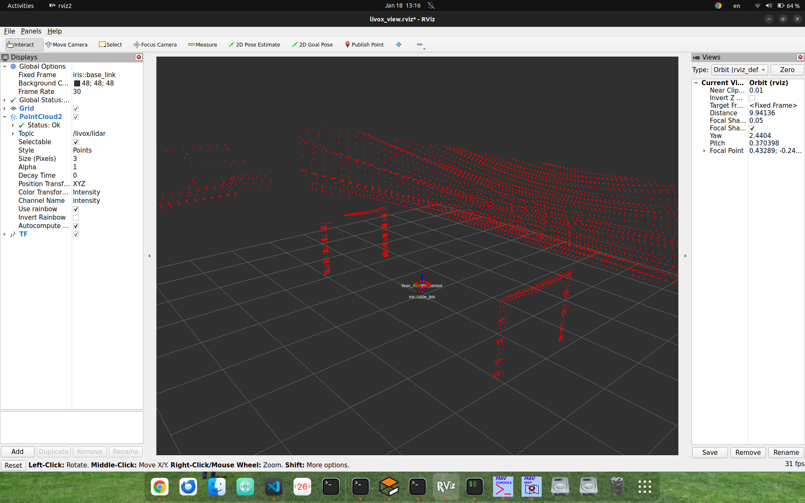
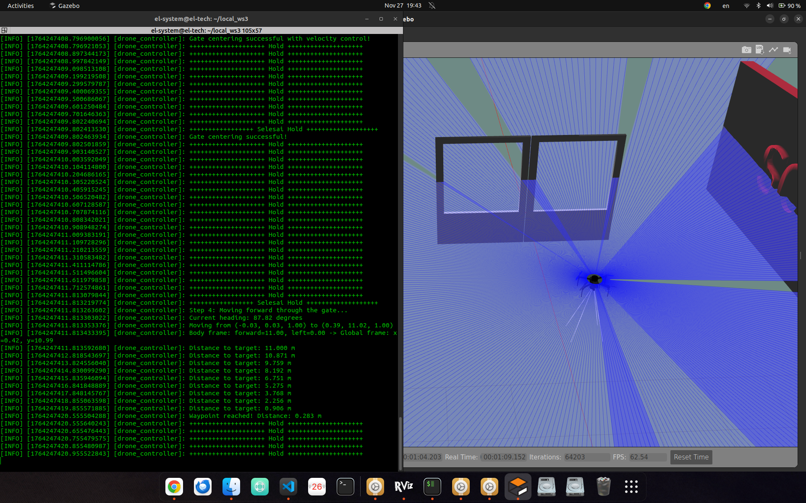

# 1. Pengenalan ROS 2

**ROS 2 (Robot Operating System 2)** adalah middleware open-source yang dirancang khusus untuk pengembangan robot. Meskipun namanya "Operating System", ROS 2 bukanlah sistem operasi seperti Linux atau Windows, melainkan **framework middleware** yang menyediakan:

- **Infrastruktur komunikasi** antar komponen robot
- **Tools dan libraries** untuk pemrograman robotik
- **Konvensi standar** untuk integrasi hardware dan software

Dengan ROS 2, developer tidak perlu membangun sistem komunikasi dari nol. ROS 2 sudah menyediakan mekanisme untuk menghubungkan sensor, aktuator, algoritma, dan komponen lainnya secara efisien.

## Peran ROS 2 dalam Robot

ROS 2 berperan sebagai **otak koordinator** dalam sistem robotik modern. Berikut peran-peran utamanya:

### 1. **Integrasi Sensor dan Aktuator**
ROS 2 memungkinkan robot untuk:
- Membaca data dari berbagai sensor (kamera, LiDAR, IMU, GPS, dll)
- Mengontrol aktuator (motor, servo, gripper, dll)
- Menggabungkan informasi dari multi-sensor (sensor fusion)

### 2. **Komunikasi Antar Komponen**
- Memfasilitasi pertukaran data antar modul secara real-time
- Mendukung komunikasi lokal (dalam satu robot) maupun distributed (multi-robot)
- Menyediakan berbagai pola komunikasi (publish-subscribe, request-response, dll)

### 3. **Modularitas dan Reusability**
- Komponen dapat dikembangkan dan diuji secara independen
- Code dapat digunakan kembali di berbagai proyek
- Mudah mengganti atau upgrade komponen tanpa mengubah keseluruhan sistem

## Arsitektur Robot dengan ROS 2

### Flight Controller, Komputer Autonomous, dan ROS 2

Dalam robot modern, terutama drone atau robot mobile, arsitektur umumnya terdiri dari beberapa layer:

```
┌─────────────────────────────────────────────────────┐
│          HIGH-LEVEL COMPUTER (Companion)            │
│                                                     │
│  ┌─────────────────────────────────────────────┐  │
│  │           ROS 2 Nodes                       │  │
│  │  • Navigation         • Object Detection    │  │
│  │  • Path Planning      • SLAM                │  │
│  │  • Decision Making    • Computer Vision     │  │
│  └─────────────────────────────────────────────┘  │
│           ↕ (MAVLink / ROS Topics)                 │
└─────────────────────────────────────────────────────┘
                         ↕
┌─────────────────────────────────────────────────────┐
│         FLIGHT CONTROLLER (Low-level Control)       │
│                                                     │
│  • Stabilization       • Motor Control             │
│  • Sensor Fusion       • Safety Systems            │
│  • Real-time Control   • Failsafe                  │
│                                                     │
│  Examples: Pixhawk, APM, Navio2, etc.              │
└─────────────────────────────────────────────────────┘
                         ↕
┌─────────────────────────────────────────────────────┐
│              HARDWARE LAYER                         │
│  • Motors/ESCs    • Sensors (IMU, GPS, etc)        │
│  • Servos         • Battery                        │
└─────────────────────────────────────────────────────┘
```

**Pembagian Tugas:**

**Flight Controller:**
- Real-time control loop (stabilisasi, altitude hold, dll)
- Low-level sensor processing (IMU, barometer)
- Safety-critical functions
- Firmware: PX4, ArduPilot, Betaflight

**Companion Computer (ROS 2):**
- High-level decision making
- Path planning dan obstacle avoidance
- Computer vision dan object recognition
- Mission planning
- Hardware: Raspberry Pi, Jetson Nano, Intel NUC

**Komunikasi:**
- MAVLink protocol untuk komunikasi antara flight controller dan ROS 2
- ROS 2 topics/services untuk komunikasi antar nodes di companion computer

## Cara Kerja ROS 2 dalam Robot

ROS 2 bekerja berdasarkan **arsitektur modular berbasis graph** dimana setiap modul adalah "node" yang saling berkomunikasi.

### Alur Kerja ROS 2:

```
1. Sensor mengambil data
         ↓
2. Driver node publish data ke topic
         ↓
3. Processing node subscribe topic, olah data
         ↓
4. Planning node terima hasil, buat keputusan
         ↓
5. Control node kirim command ke aktuator
         ↓
6. Aktuator (motor) bergerak
```

### Contoh Konkret: Robot Delivery

```
┌─────────────┐
│ Camera Node │ ──→ /camera/image ──→ ┌──────────────────┐
└─────────────┘                       │ Object Detection │
                                      │      Node        │
┌─────────────┐                       └────────┬─────────┘
│ LiDAR Node  │ ──→ /scan ──────────────→     │
└─────────────┘                               ↓
                                    ┌─────────────────┐
┌─────────────┐                     │ Path Planning   │
│  GPS Node   │ ──→ /gps ─────→     │      Node       │
└─────────────┘                     └────────┬────────┘
                                             ↓
                                    ┌─────────────────┐
                                    │ Motor Control   │
                                    │      Node       │
                                    └────────┬────────┘
                                             ↓
                                    ┌─────────────────┐
                                    │   Motor/Wheel   │
                                    └─────────────────┘
```

**Langkah-langkah:**
1. **Camera Node** publish gambar ke topic `/camera/image`
2. **LiDAR Node** publish scan data ke topic `/scan`
3. **GPS Node** publish posisi ke topic `/gps`
4. **Object Detection Node** subscribe `/camera/image`, deteksi obstacle
5. **Path Planning Node** subscribe semua sensor data, hitung jalur optimal
6. **Motor Control Node** terima path, kontrol kecepatan roda
7. Robot bergerak menghindari obstacle menuju tujuan

### Keuntungan Arsitektur Ini:
- **Parallel Processing**: Semua sensor bekerja simultan
- **Loosely Coupled**: Ganti camera tidak perlu ubah path planning
- **Testable**: Bisa test tiap node secara independen
- **Scalable**: Tambah sensor baru tanpa ganggu sistem existing


## Konsep Dasar: Nodes, Topics, Services

### 1. **Nodes**

**Node** adalah program individu dalam ROS 2. Bayangkan seperti pekerja dalam pabrik - setiap pekerja punya tugas masing-masing.

**Contoh sederhana:**
```
Robot Sederhana:
├── camera_node        → Ambil gambar dari kamera
├── detector_node      → Deteksi objek dari gambar
└── motor_node         → Gerakkan motor
```

**Kenapa pakai Nodes?**
- **Modular**: Ganti satu bagian tanpa ganggu yang lain
- **Parallel**: Semua nodes jalan bersamaan
- **Reusable**: Pakai ulang di proyek lain
- **Safe**: Kalau satu crash, yang lain tetap jalan

### 2. **Topics**

**Topic** adalah "saluran komunikasi" tempat nodes kirim dan terima data.

**Analogi sederhana:**
```
Bayangkan radio:
- Topic = Frekuensi radio (FM 101.5)
- Publisher = Stasiun radio yang broadcast musik
- Subscriber = Radio mobil yang dengar musik
```

**Contoh dalam robot:**
```
┌─────────────┐
│ Camera Node │ ──publish──> Topic: /camera/image ──subscribe──> ┌──────────────┐
└─────────────┘                                                  │ Display Node │
                                                                 └──────────────┘
```

**Sifat Topics:**
- **Satu arah**: Publisher kirim, subscriber terima
- **Many-to-many**: Banyak publisher, banyak subscriber boleh
- **Continuous**: Data terus mengalir seperti streaming

### 3. **Publisher - Yang Mengirim Data**

**Publisher** adalah node yang mengirimkan data ke topic.

**Contoh Python sederhana:**
```python
# Node yang publish data suhu
import rclpy
from rclpy.node import Node
from std_msgs.msg import Float32

class TemperaturePublisher(Node):
    def __init__(self):
        super().__init__('temperature_publisher')
        
        # Buat publisher ke topic 'temperature'
        self.publisher = self.create_publisher(Float32, 'temperature', 10)
        
        # Kirim data setiap 1 detik
        self.timer = self.create_timer(1.0, self.send_temperature)
        self.temp = 25.0
    
    def send_temperature(self):
        msg = Float32()
        msg.data = self.temp
        self.publisher.publish(msg)  # Kirim data
        print(f'Kirim suhu: {self.temp}°C')
        self.temp += 0.5  # Suhu naik
```

**Penjelasan:**
1. Buat publisher ke topic `temperature`
2. Setiap 1 detik, kirim data suhu
3. Data bertipe `Float32` (angka desimal)

### 4. **Subscriber - Yang Menerima Data**

**Subscriber** adalah node yang menerima data dari topic.

**Contoh Python sederhana:**
```python
# Node yang terima data suhu
import rclpy
from rclpy.node import Node
from std_msgs.msg import Float32

class TemperatureSubscriber(Node):
    def __init__(self):
        super().__init__('temperature_subscriber')
        
        # Buat subscriber dari topic 'temperature'
        self.subscription = self.create_subscription(
            Float32, 
            'temperature', 
            self.temperature_callback,  # Fungsi yang dipanggil saat ada data
            10
        )
    
    def temperature_callback(self, msg):
        # Fungsi ini jalan otomatis setiap ada data baru
        print(f'Terima suhu: {msg.data}°C')
        
        # Cek kalau suhu tinggi
        if msg.data > 30.0:
            print('Peringatan: Suhu terlalu tinggi!')
```

**Penjelasan:**
1. Subscribe ke topic `temperature`
2. Setiap ada data baru, `temperature_callback` dipanggil otomatis
3. Bisa langsung proses data (cek suhu, tampilkan, dll)

**Ilustrasi Publisher-Subscriber:**
```
Publisher Node                      Subscriber Node
┌──────────────┐                   ┌──────────────┐
│              │                   │              │
│  Kirim data  │──→ Topic /temp ──→│ Terima data  │
│  setiap 1s   │   (Float32)       │ & proses     │
│              │                   │              │
└──────────────┘                   └──────────────┘
   25.0°C  ────────────────────────→  "Suhu: 25°C"
   25.5°C  ────────────────────────→  "Suhu: 25.5°C"
   26.0°C  ────────────────────────→  "Suhu: 26°C"
```

### 5. **Services - Request-Response**

**Service** untuk komunikasi dua arah: tanya-jawab.

**Analogi sederhana:**
```
Seperti tanya Google Maps:
- Kamu tanya: "Jarak Jakarta ke Bandung?"
- Google jawab: "150 km"
```

**Contoh dalam robot:**
```
Client Node                        Server Node
┌──────────────┐                  ┌──────────────┐
│              │                  │              │
│ Tanya: 5+3?  │─────Request─────→│ Hitung...    │
│              │                  │              │
│ Jawab: 8     │←────Response─────│ Kirim: 8     │
│              │                  │              │
└──────────────┘                  └──────────────┘
```

**Contoh Python - Service Server:**
```python
# Node yang menjawab pertambahan
from example_interfaces.srv import AddTwoInts

class CalculatorServer(Node):
    def __init__(self):
        super().__init__('calculator')
        
        # Buat service
        self.service = self.create_service(
            AddTwoInts,           # Tipe service
            'add_two_numbers',    # Nama service
            self.add_callback     # Fungsi yang handle request
        )
    
    def add_callback(self, request, response):
        # Terima request, hitung, kirim response
        response.sum = request.a + request.b
        print(f'{request.a} + {request.b} = {response.sum}')
        return response
```

**Contoh Python - Service Client:**
```python
# Node yang tanya perhitungan
from example_interfaces.srv import AddTwoInts

class CalculatorClient(Node):
    def __init__(self):
        super().__init__('calculator_client')
        
        # Buat client
        self.client = self.create_client(AddTwoInts, 'add_two_numbers')
    
    def ask_calculation(self, a, b):
        # Buat request
        request = AddTwoInts.Request()
        request.a = a
        request.b = b
        
        # Kirim dan tunggu jawaban
        future = self.client.call_async(request)
        # Hasil ada di future.result().sum
```

**Perbedaan Topics vs Services:**

| Topics | Services |
|--------|----------|
| Continuous streaming | One-time tanya-jawab |
| Publisher tidak tahu siapa yang subscribe | Client tahu server yang dipanggil |
| Banyak subscriber boleh | Satu client, satu server |
| Untuk sensor data, status | Untuk perhitungan, query |

**Kapan pakai mana?**
- **Topics**: Sensor data (kamera, GPS, suhu), status robot
- **Services**: Perhitungan (inverse kinematics), perintah (take photo, reset)

### Karakteristik Node:
- **Independent Process**: Berjalan sebagai proses terpisah di sistem operasi
- **Single Purpose**: Melakukan satu tugas spesifik dengan baik
- **Communicative**: Berkomunikasi dengan node lain via topics, services, actions
- **Isolated**: Crash satu node tidak mematikan seluruh sistem

### Contoh Nodes dalam Sistem Robot:

```
Robot Navigation System:
├── /camera_driver          → Akses hardware kamera
├── /image_processor        → Preprocessing gambar
├── /object_detector        → Deteksi objek dengan ML
├── /lidar_driver           → Baca LiDAR sensor
├── /mapper                 → Buat peta lingkungan
├── /localizer              → Tentukan posisi robot
├── /path_planner           → Rencanakan jalur
├── /obstacle_avoider       → Hindari obstacle
├── /motor_controller       → Kontrol motor
└── /battery_monitor        → Monitor daya
```

### Pola Komunikasi Antar Nodes:

**1. Topics (Publish-Subscribe)**
```
Publisher Node ──→ Topic ──→ Subscriber Node(s)
(Asynchronous, many-to-many)
```

**2. Services (Request-Response)**
```
Client Node ←→ Service ←→ Server Node
(Synchronous, one-to-one)
```

**3. Actions (Goal-Feedback-Result)**
```
Action Client ←→ Action ←→ Action Server
(Asynchronous with feedback, cancelable)
```

## Bahasa Pemrograman ROS 2

ROS 2 mendukung berbagai bahasa pemrograman dengan Client Libraries:

### 1. **Python (rclpy)**
```python
import rclpy
from rclpy.node import Node

class MyNode(Node):
    def __init__(self):
        super().__init__('my_node')
        self.get_logger().info('Node started!')
```

**Keunggulan:**
-  Mudah dipelajari dan cepat prototyping
-  Cocok untuk machine learning (TensorFlow, PyTorch)
-  Rich ecosystem (NumPy, OpenCV, SciPy)
-  Ideal untuk computer vision dan AI

**Kapan Digunakan:**
- Prototyping dan development cepat
- Computer vision dan image processing
- Machine learning dan AI
- High-level decision making

### 2. **C++ (rclcpp)**
```cpp
#include "rclcpp/rclcpp.hpp"

class MyNode : public rclcpp::Node {
public:
    MyNode() : Node("my_node") {
        RCLCPP_INFO(this->get_logger(), "Node started!");
    }
};
```

**Keunggulan:**
- Performa tinggi dan low latency
- Memory efficient
- Deterministic execution
- Real-time capable

**Kapan Digunakan:**
- Control loops yang membutuhkan real-time performance
- Driver hardware yang butuh low-level access
- Systems dengan resource terbatas
- High-frequency data processing

### 3. **Bahasa Lain**
- **Rust** (rclrs) - Experimental, focus pada safety
- **Java** (rcljava) - Untuk Android robotics
- **C#** - Experimental

### Kombinasi Python + C++

Praktek terbaik adalah menggunakan keduanya:

```
High-level (Python):
├── Mission planning
├── Object detection
├── Path planning
└── User interface

Low-level (C++):
├── Motor drivers
├── Sensor drivers
├── Control loops
└── Safety systems
```

## Software Tools ROS 2

ROS 2 menyediakan ekosistem tools yang lengkap untuk development robotik:

### 1. **RViz2** - 3D Visualization Tool



**Fungsi:**
- Visualisasi state robot dalam 3D
- Display sensor data (LiDAR, camera, point cloud)
- Debugging TF (coordinate frames)
- Interactive markers untuk kontrol manual

**Kegunaan:**
- Debug sensor data
- Visualize path planning
- Monitor robot status real-time
- Verifikasi TF transforms

### 2. **Gazebo** - Robot Simulator



**Fungsi:**
- Simulasi robot dalam lingkungan virtual
- Test algoritma tanpa hardware
- Training environment untuk AI/ML
- Multi-robot simulation

**Kegunaan:**
- Development tanpa risiko kerusakan hardware
- Test skenario berbahaya (crash, jatuh)
- Rapid prototyping
- Automated testing

**Contoh Workflow:**
1. Develop algoritma di Gazebo
2. Test di simulator
3. Deploy ke robot real
4. Fine-tune dengan real data

## Komunitas dan Resource

### Official Resources:
- **Website**: https://www.ros.org
- **Documentation**: https://docs.ros.org/en/jazzy/
- **Tutorials**: https://docs.ros.org/en/jazzy/Tutorials.html
- **GitHub**: https://github.com/ros2

### Community:
- **ROS Discourse**: https://discourse.ros.org
- **ROS Answers**: https://answers.ros.org
- **Slack/Discord**: Various ROS communities
- **Stack Overflow**: Tag `ros2`

### Learning Resources:
- The Construct (online courses)
- ROS 2 Documentation
- GitHub repositories dengan contoh
- YouTube tutorials

## Rangkuman

- ROS 2 adalah framework middleware untuk robotika
- Jazzy adalah distribusi LTS dengan support 5 tahun
- Konsep dasar: Nodes, Topics, Services, Actions, Parameters
- Menggunakan DDS untuk komunikasi yang robust
- Mendukung multiple platform dan bahasa pemrograman
- Cocok untuk pengembangan robot profesional dan penelitian

## Next Steps

Lanjut ke [Instalasi ROS 2 Jazzy](02_instalasi.md) untuk memulai setup environment Anda!

---

**Tips**: Jangan terburu-buru. Pahami konsep fundamental dulu sebelum jumping ke coding!
